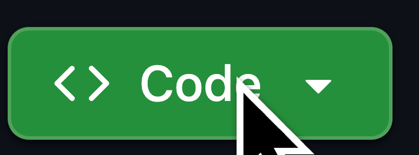

# BTYoutube

BTYoutube (or BTYT) ports a better design and a Spotlight search remake to youtube!

## How to Install

- step 1

download the source code by going under ``code`` and clicking ``download ZIP``



- step 2

then go to `chrome://extensions` and enable ``developer mode``


- step 3

click ``load unpacked``


- step 4

lastly just select ``BTYoutube`` and reload youtube.

- finished installing

**now you have ``BTYoutube`` installed!**

## Alternatively through terminal

DISCLAIMER: this does NOT work on windows, use the WSL (Linux Subsystem for Windows) if you want to install.

- step 1

**create a variable to the path**

run
```bash
BTYT="path_to_BTYoutube_folder_here"
```

- step 2

**install BTYoutube**

run

```bash
open -a "your_browser" --args --load-extension="$BTYT"
```

- step 3

**apply changes to current sessions**

reload your active YouTube pages to apply the extension

- finished install

**now you installed BTYT (short for BTYoutube) through the terminal!**
